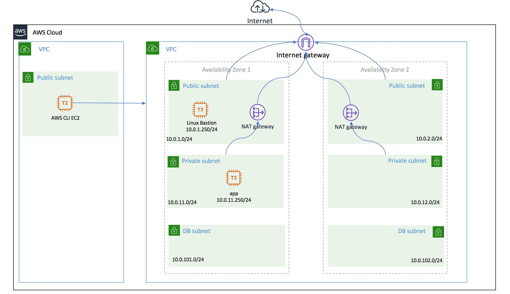
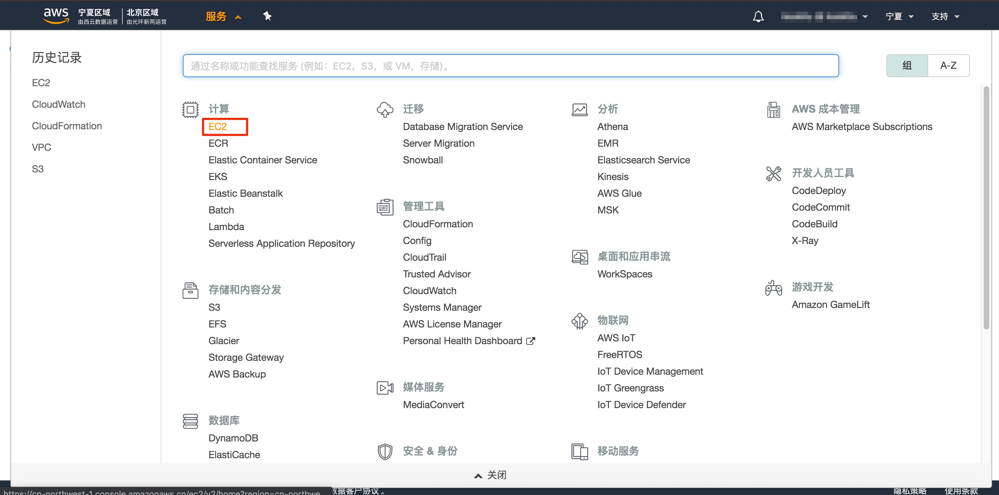
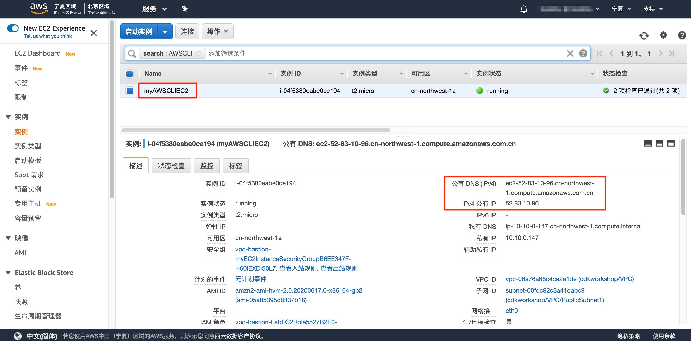
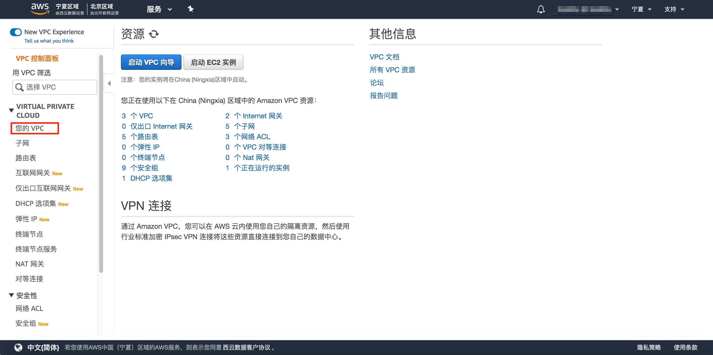
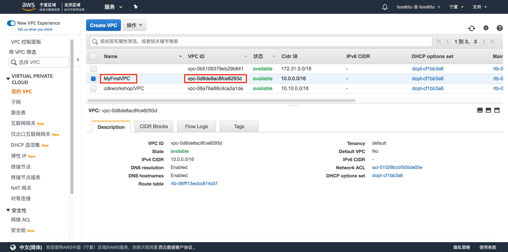
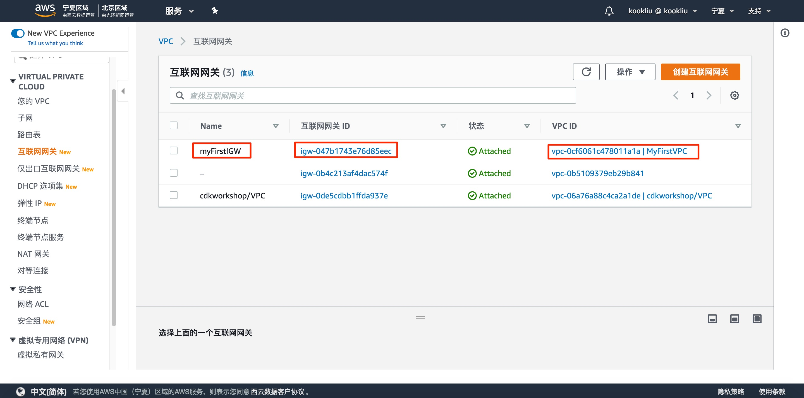
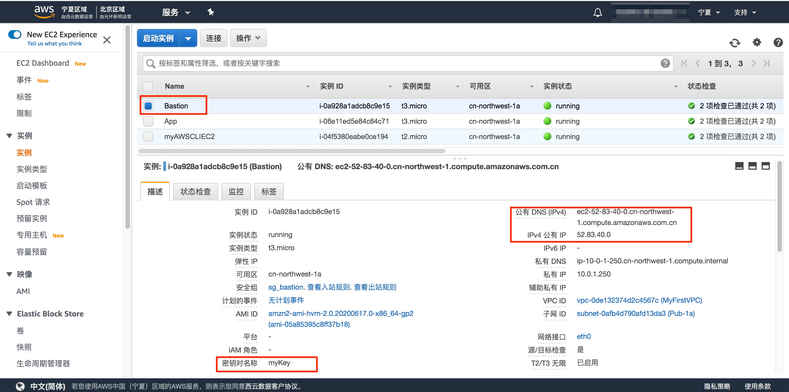

# 使用AWS CLI管理VPC/Subnet/Route Table/Security Group等

#### 实验介绍：

本实验旨在通过AWS CLI命令对于AWS云上的网络基础架构环境进行管理，从而熟悉AWS CLI的基本使用方法，并且对于AWS 云上的网络基础架构有所了解，并且掌握基本操作和配置管理。在命令行的角度上深入理解架构。在操作角度上，通过非交互的模式创建，配合AWS 图形Console上反馈结果来观察整个个操作流程。从而掌握基本组件的使用逻辑和关系。


下图就是我们需要构建的一个基本满足Multi-AZ的云上的基础的VPC网络环境，并添加2个vm进行测试。



#### 相关服务：

VPC、Subnet、Route Table、Security Group、Nat GW、IGW


#### 实验时间：

120分钟


#### 技术要求：

熟悉AWS VPC和安全组的基本概念。

掌握了AWS Console的基本控制方法

掌握如何登入到AWS Console上的实例


#### 目标一：登入我们的AWC CLI所在的Linux环境

##### 1.1 查看生成的AWS CLI主机。

在启动实验后，我登入到AWS Console的界面下，进入Ec2服务下。



点击正在运行的实例。


查看我们实验自动生成的实例”myAWSCLIEC2“ 。



然后我们使用提供的key登入这台Linux系统。具体方式请参考Console登入指南。


#### 目标二：创建VPC、Subnet等基本网络环境。


##### 2.1 配置AWS CLI的基本环境

我们当前使用ec2-user用户登入后，由于使用的系统是AWS AMI，默认已经安装了aws cli，所以我们只要配置一下就可以使用aws cli了。

使用命令aws configure, 得到如下输出。其中AK、SK是作为编程入口时，可以使用到的配置参数。当前我们使用的是IAM Role，所以这里目前设置为空。 而“Default region name [None]:”, 我们由于在宁夏region进行学习，所有这里选择填写cn-northwest-1即可。最后一项为输出格式，我们选择默认为空即可。

```shell
$ aws configure
AWS Access Key ID [None]:
AWS Secret Access Key [None]:
Default region name [None]: cn-northwest-1
Default output format [None]:
```


##### 2.2 创建基本的VPC

使用如下命令创建基本的vpc,并且使用”aws ec2 create-vpc --cidr-block 10.0.0.0/24” 命令执行，会得到如下类似输出。请记录好VpcId的输出值“vpc-0cf6061c478011a1a”，在后面的命令中，我们会使用到。为了便于后面的命令使用，我们将他记录为变量。

我们执行的命令：

1：创建VPC

```
aws ec2 create-vpc --cidr-block 10.0.0.0/16
```

2：添加变量保存VpcId，用于后面调用。通过第一个命令的输出进行获取后，替换当前值。

```
export VPC_ID="vpc-xxxxxxxxxxxxx"  
```


上面的两条命令输出结果如下：

```shell
$ aws ec2 create-vpc --cidr-block 10.0.0.0/16
{
    "Vpc": {
        "VpcId": "vpc-0d8de8ac8fce8293d",
        "InstanceTenancy": "default",
        "CidrBlockAssociationSet": [
            {
                "AssociationId": "vpc-cidr-assoc-0cacbddec39a88bff",
                "CidrBlock": "10.0.0.0/16",
                "CidrBlockState": {
                    "State": "associated"
                }
            }
        ],
        "Ipv6CidrBlockAssociationSet": [],
        "State": "pending",
        "DhcpOptionsId": "dopt-cf1bb3a6",
        "OwnerId": "383932990026",
        "CidrBlock": "10.0.0.0/16",
        "IsDefault": false
    }
}
$ export VPC_ID="vpc-0d8de8ac8fce8293d"
```

我们对当前创建的vpc添加Tag, "Name=MyFirstVPC",具体命令如下。输出为空。启用dnsname、hostname。

执行命令：

1:   为当前的VPC添加tag，标签为MyFirstVPC

```
aws ec2 create-tags --resources ${VPC_ID} --tags Key=Name,Value=MyFirstVPC 
```

2:  为当前VPC启用DNS支持

```
aws ec2 modify-vpc-attribute --vpc-id ${VPC_ID} --enable-dns-support '{"Value": true}'
```

3:  为当前VPC启用Hostname支持

```
aws ec2 modify-vpc-attribute --vpc-id ${VPC_ID} --enable-dns-hostnames '{"Value": true}'
```


命令的输出结果如下：

```
$ aws ec2 create-tags --resources ${VPC_ID} --tags Key=Name,Value=MyFirstVPC
$ aws ec2 modify-vpc-attribute --vpc-id ${VPC_ID} --enable-dns-support '{"Value": true}'
$ aws ec2 modify-vpc-attribute --vpc-id ${VPC_ID} --enable-dns-hostnames '{"Value": true}'
```


我们进入AWS 图形Console查看输出结果, 选择“服务”-“VPC”



选择“你的VPC”进行查看，我们刚刚创建好的vpc, 对应的我们可以看到我们创建的tag和VpcId的信息。我们可以对比看看我们上面命令行的输出。



两个设定的自行检查，请同学们，在图形界面下找到我们关于"enable-dns-support"、"enable-dns-hostnames"的对应配置位置。


##### 2.3 创建VPC下的IGW

我们继续回到命令行界面下，添加internet gateway(IGW), 请记录下InternetGatewayId的输出，后面我们会用到。

命令： 

1:  创建Internet Gateway

```
aws ec2 create-internet-gateway
```

2:  添加变量来保存当前的IGW ID, 用于后面的调用，通过第一个命令的输出进行获取后，替换当前值。

```
export INTERNET_GATEWAY_ID="igw-xxxxxxxxxxxxxxx"  
```


上面2条命令的输出结果如下：

```shell
$ aws ec2 create-internet-gateway
{
    "InternetGateway": {
        "OwnerId": "383932990026",
        "Tags": [],
        "Attachments": [],
        "InternetGatewayId": "igw-0ad56b59665ff00ff"
    }
}
$ export INTERNET_GATEWAY_ID="igw-0ad56b59665ff00ff"
```


为这个创建igw添加一个tag "myFirstIGW"

```shell
$ aws ec2 create-tags --resources ${INTERNET_GATEWAY_ID} --tags Key=Name,Value=myFirstIGW
```

将这个igw关联到我们目前的vpc上。

```shell
$ aws ec2 attach-internet-gateway --internet-gateway-id ${INTERNET_GATEWAY_ID} --vpc-id ${VPC_ID}
```


我们检查一下当前Internate Gateway在AWS 图形界面下的一个结果：




##### 2.4 创建VPC下的Subnet、EIP 、Nat GW、Route Table

依据本实验最上面的架构图，我们可以做这样一个表格用来创建subnet，下面我们会分别依据az1来依次创建我们不同的subnet，并且关联相应的路由表。

| Subnet         | AZ1                            | AZ2                         |
| -------------- | ------------------------------ | --------------------------- |
| Public Subnet  | Pub-1a   10.0.1.0/24  (Nat-1a) | Pub-1b 10.0.2.0/24 (Nat-1b) |
| Private Subnet | Pri-1a  10.0.11.0/24           | Pri-1b  10.0.12.0/24        |
| DB Subnet      | DB-1a  10.0.101.0/24           | DB-1b  10.0.102.0/24        |

我们首先在AZ1创建逻辑上的Public区的Pub-1a和Pri-1a：

1:  创建Pub-1a的subnet 

```
aws ec2 create-subnet --vpc-id ${VPC_ID} --availability-zone cn-northwest-1a --cidr-block 10.0.1.0/24
```

2：为Pub-1a添加tag,通过第一个命令获取到输出的SubnetId作为参数, 请自行替换xxxxxxxxxxx。

```
aws ec2 create-tags --resources subnet-xxxxxxxxxxxxxxxx --tags Key=Name,Value=Pub-1a 
```

3：为Nat-1a创建EIP

```
aws ec2 allocate-address 
```

4:  创建Nat Gateway, 其中参数subnet-id和allocation-id是通过第1、3条命令输出获取的，请自行替换xxxxxxxxxxx。

```
aws ec2 create-nat-gateway --subnet-id subnet-xxxxxxxxxxxxxxxx  --allocation-id eipalloc-xxxxxxxxxxxxxxxx  
```

5:  创建Pri-1a的subnet

```
aws ec2 create-subnet --vpc-id ${VPC_ID} --availability-zone cn-northwest-1a --cidr-block 10.0.11.0/24
```

6: 为Pri-1a添加tag, 通过命令获取到subnetID ， 请自行替换xxxxxxxxxxx。

```
aws ec2 create-tags --resources subnet-xxxxxxxxxxxxxxxx --tags Key=Name,Value=Pri-1a
```

7:  创建DB-1a的subnet

```
aws ec2 create-subnet --vpc-id ${VPC_ID} --availability-zone cn-northwest-1a --cidr-block 10.0.101.0/24
```

8: 为DB-1a添加Tag,通过命令7获取到subnetId ，请自行替换xxxxxxxxxxx。

```
aws ec2 create-tags --resources subnet-xxxxxxxxxxxxxxxx --tags Key=Name,Value=DB-1a
```


上面8个命令的输出结果如下：

```shell
$ aws ec2 create-subnet --vpc-id ${VPC_ID} --availability-zone cn-northwest-1a --cidr-block 10.0.1.0/24
{
    "Subnet": {
        "MapPublicIpOnLaunch": false,
        "AvailabilityZoneId": "cnnw1-az1",
        "AvailableIpAddressCount": 251,
        "DefaultForAz": false,
        "SubnetArn": "arn:aws-cn:ec2:cn-northwest-1:383932990026:subnet/subnet-0face17d1f922f510",
        "Ipv6CidrBlockAssociationSet": [],
        "VpcId": "vpc-0d8de8ac8fce8293d",
        "State": "available",
        "AvailabilityZone": "cn-northwest-1a",
        "SubnetId": "subnet-0face17d1f922f510",
        "OwnerId": "383932990026",
        "CidrBlock": "10.0.1.0/24",
        "AssignIpv6AddressOnCreation": false
    }
}
$ aws ec2 create-tags --resources subnet-0face17d1f922f510 --tags Key=Name,Value=Pub-1a
$ aws ec2 allocate-address
{
    "Domain": "vpc",
    "PublicIpv4Pool": "amazon",
    "PublicIp": "68.79.6.131",
    "AllocationId": "eipalloc-0b34ed1fc9c755ea9",
    "NetworkBorderGroup": "cn-northwest-1"
}
$ aws ec2 create-nat-gateway --subnet-id subnet-0face17d1f922f510  --allocation-id eipalloc-0b34ed1fc9c755ea9
{
    "NatGateway": {
        "NatGatewayAddresses": [
            {
                "AllocationId": "eipalloc-0b34ed1fc9c755ea9"
            }
        ],
        "VpcId": "vpc-0d8de8ac8fce8293d",
        "State": "pending",
        "NatGatewayId": "nat-055c4ee94884da3bf",
        "SubnetId": "subnet-0face17d1f922f510",
        "CreateTime": "2020-07-13T11:43:38.000Z"
    }
}
$ aws ec2 create-tags --resources nat-055c4ee94884da3bf  --tags Key=Name,Value=Nat-1a
$ aws ec2 create-subnet --vpc-id ${VPC_ID} --availability-zone cn-northwest-1a --cidr-block 10.0.11.0/24
{
    "Subnet": {
        "MapPublicIpOnLaunch": false,
        "AvailabilityZoneId": "cnnw1-az1",
        "AvailableIpAddressCount": 251,
        "DefaultForAz": false,
        "SubnetArn": "arn:aws-cn:ec2:cn-northwest-1:383932990026:subnet/subnet-0d46b656a622bd24e",
        "Ipv6CidrBlockAssociationSet": [],
        "VpcId": "vpc-0d8de8ac8fce8293d",
        "State": "available",
        "AvailabilityZone": "cn-northwest-1a",
        "SubnetId": "subnet-0d46b656a622bd24e",
        "OwnerId": "383932990026",
        "CidrBlock": "10.0.11.0/24",
        "AssignIpv6AddressOnCreation": false
    }
}
$ aws ec2 create-tags --resources subnet-0d46b656a622bd24e --tags Key=Name,Value=Pri-1a
$ aws ec2 create-subnet --vpc-id ${VPC_ID} --availability-zone cn-northwest-1a --cidr-block 10.0.101.0/24
{
    "Subnet": {
        "MapPublicIpOnLaunch": false,
        "AvailabilityZoneId": "cnnw1-az1",
        "AvailableIpAddressCount": 251,
        "DefaultForAz": false,
        "SubnetArn": "arn:aws-cn:ec2:cn-northwest-1:383932990026:subnet/subnet-0b6c40c5f2597aaab",
        "Ipv6CidrBlockAssociationSet": [],
        "VpcId": "vpc-0d8de8ac8fce8293d",
        "State": "available",
        "AvailabilityZone": "cn-northwest-1a",
        "SubnetId": "subnet-0b6c40c5f2597aaab",
        "OwnerId": "383932990026",
        "CidrBlock": "10.0.101.0/24",
        "AssignIpv6AddressOnCreation": false
    }
$ aws ec2 create-tags --resources subnet-0b6c40c5f2597aaab --tags Key=Name,Value=DB-1a
```


接下来，我们就要依据下图，为AZ1的Pub1-1a和Pri-1a创建所有关联的路由表，而DB-1a默认我们设计不接入互联网，所以使用默认的路由表即可。

| Route Table | AZ1              | AZ2             | Gateway |
| ----------- | ---------------- | --------------- | ------- |
| pub-rtb     | Pub-1a (subnet)  | Pub-1b (subnet) | IGW     |
| pri-rtb-1a  | Pri-1a  (subnet) |                 | Nat-1a  |
| pri-rtb-1b  |                  | Pri-1b (subnet) | Nat-1b  |
| default     | DB-1a (subnet)   | DB-1b (subnet)  | None    |

具体命令如下：

1:  首先创建路由表pub-rtb

```
aws ec2 create-route-table --vpc-id ${VPC_ID}
```

2:  为这个路由表打tag，命名为pub-rtb, 下面的rtbId，是通过命令1获取的， 请自行替换xxxxxxxxxxx。

```
aws ec2 create-tags --resources rtb-xxxxxxxxxxxxxxxx --tags Key=Name,Value=pub-rtb
```

3：添加路由到这个路由表，下面的rtbId，是通过命令1获取的， 请自行替换xxxxxxxxxxx。

```
aws ec2 create-route --route-table-id rtb-xxxxxxxxxxxxxxxx --destination-cidr-block 0.0.0.0/0 --gateway-id ${INTERNET_GATEWAY_ID}
```

4:  关联这个路由表到Pub-1a这个subnet， 下面的rtbId，是通过命令1获取的，subnet是在上面产生的。请自行替换xxxxxxxxx。

```
aws ec2 associate-route-table --route-table-id rtb-xxxxxxxxxxxxxxxx  --subnet-id  subnet-xxxxxxxxxxxxxxxx
```

5: 创建空路由表pri-rtb-1a

```
aws ec2 create-route-table --vpc-id ${VPC_ID}
```

6: 为这个路由表打tag，命名为Pri-rtb-1a，是通过上1个命令获取的，请自行替换xxxxxxxxxxxxxx。

```
aws ec2 create-tags --resources rtb-xxxxxxxxxxxxxxxx --tags Key=Name,Value=pri-rtb-1a
```

7: 添加路由到这个路由表pri-rtb-1a,  这里的路由指向的网关应该是nat-1a的id，请自行替换xxxxxxxxxxxxxxxxxxx。

```
aws ec2 create-route --route-table-id rtb-xxxxxxxxxxxxxxxx --destination-cidr-block 0.0.0.0/0 --gateway-id   nat-xxxxxxxxxxxxxxxx
```

8: 关联这个路由表到Pri-1a这个subnet，请自行替换xxxxxxxxxxxxxxxxxxx。

```
aws ec2 associate-route-table --route-table-id rtb-xxxxxxxxxxxxxxxx  --subnet-id  subnet-xxxxxxxxxxxxxxxx
```


这8条命令输出的结果如下：

```shell
$ aws ec2 create-route-table --vpc-id ${VPC_ID}
{
    "RouteTable": {
        "Associations": [],
        "RouteTableId": "rtb-056a82fad47f06750",
        "VpcId": "vpc-0d8de8ac8fce8293d",
        "PropagatingVgws": [],
        "Tags": [],
        "Routes": [
            {
                "GatewayId": "local",
                "DestinationCidrBlock": "10.0.0.0/16",
                "State": "active",
                "Origin": "CreateRouteTable"
            }
        ],
        "OwnerId": "383932990026"
    }
}
$ aws ec2 create-tags --resources rtb-056a82fad47f06750 --tags Key=Name,Value=pub-rtb
$ aws ec2 create-route --route-table-id rtb-056a82fad47f06750 --destination-cidr-block 0.0.0.0/0 --gateway-id ${INTERNET_GATEWAY_ID}
{
    "Return": true
}
$ aws ec2 associate-route-table --route-table-id rtb-056a82fad47f06750  --subnet-id  subnet-0face17d1f922f510
{
    "AssociationState": {
        "State": "associated"
    },
    "AssociationId": "rtbassoc-042196b9bf2126a81"
}
$ aws ec2 create-route-table --vpc-id ${VPC_ID}
{
    "RouteTable": {
        "Associations": [],
        "RouteTableId": "rtb-09c0c9530511640cc",
        "VpcId": "vpc-0d8de8ac8fce8293d",
        "PropagatingVgws": [],
        "Tags": [],
        "Routes": [
            {
                "GatewayId": "local",
                "DestinationCidrBlock": "10.0.0.0/16",
                "State": "active",
                "Origin": "CreateRouteTable"
            }
        ],
        "OwnerId": "383932990026"
    }
}
$ aws ec2 create-tags --resources rtb-09c0c9530511640cc --tags Key=Name,Value=pri-rtb-1a
$ aws ec2 create-route --route-table-id rtb-09c0c9530511640cc --destination-cidr-block 0.0.0.0/0 --gateway-id  nat-055c4ee94884da3bf
{
    "Return": true
}
$ aws ec2 associate-route-table --route-table-id rtb-09c0c9530511640cc  --subnet-id  subnet-0d46b656a622bd24e
{
    "AssociationState": {
        "State": "associated"
    },
    "AssociationId": "rtbassoc-0438c871f92030bb6"
}
```


上面的命令只是为了让大家理解资源间的关联关系。为了避免操作失误，现在请在图形界面里面删除刚才创建的vpc。

1：删除服务VPC下Nat 网关。

2：释放弹性 IP.

3:  删除“MyFirstVPC”


使用下面的命令快速创建VPC环境和所有的资源。请复制下面命令，直接拷贝到命令行下，执行。

```shell
VPC_ID=$(aws ec2 create-vpc --cidr-block 10.0.0.0/16 --output text --query 'Vpc.VpcId')
aws ec2 create-tags --resources ${VPC_ID} --tags Key=Name,Value=MyFirstVPC
aws ec2 modify-vpc-attribute --vpc-id ${VPC_ID} --enable-dns-support '{"Value": true}'
aws ec2 modify-vpc-attribute --vpc-id ${VPC_ID} --enable-dns-hostnames '{"Value": true}'

INTERNET_GATEWAY_ID=$(aws ec2 create-internet-gateway --output text --query 'InternetGateway.InternetGatewayId')
aws ec2 create-tags --resources ${INTERNET_GATEWAY_ID} --tags Key=Name,Value=myFirstIGW
aws ec2 attach-internet-gateway --internet-gateway-id ${INTERNET_GATEWAY_ID} --vpc-id ${VPC_ID}


PUB1A_SUBID=$(aws ec2 create-subnet --vpc-id ${VPC_ID} --availability-zone cn-northwest-1a --cidr-block 10.0.1.0/24 --output text --query 'Subnet.SubnetId')
aws ec2 create-tags --resources $PUB1A_SUBID --tags Key=Name,Value=Pub-1a

NAT1A_EIP_ID=$(aws ec2 allocate-address --output text --query 'AllocationId')
NAT1A_ID=$(aws ec2 create-nat-gateway --subnet-id $PUB1A_SUBID  --allocation-id $NAT1A_EIP_ID --output text --query 'NatGateway.NatGatewayId')

PRI1A_SUBID=$(aws ec2 create-subnet --vpc-id ${VPC_ID} --availability-zone cn-northwest-1a --cidr-block 10.0.11.0/24 --output text --query 'Subnet.SubnetId')
aws ec2 create-tags --resources $PRI1A_SUBID --tags Key=Name,Value=Pri-1a

DB1A_SUBID=$(aws ec2 create-subnet --vpc-id ${VPC_ID} --availability-zone cn-northwest-1a --cidr-block 10.0.101.0/24 --output text --query 'Subnet.SubnetId')
aws ec2 create-tags --resources $DB1A_SUBID --tags Key=Name,Value=DB-1a


PUB1B_SUBID=$(aws ec2 create-subnet --vpc-id ${VPC_ID} --availability-zone cn-northwest-1b --cidr-block 10.0.2.0/24 --output text --query 'Subnet.SubnetId')
aws ec2 create-tags --resources $PUB1B_SUBID --tags Key=Name,Value=Pub-1b

NAT1B_EIP_ID=$(aws ec2 allocate-address --output text --query 'AllocationId')
NAT1B_ID=$(aws ec2 create-nat-gateway --subnet-id $PUB1B_SUBID  --allocation-id $NAT1B_EIP_ID --output text --query 'NatGateway.NatGatewayId')

PRI1B_SUBID=$(aws ec2 create-subnet --vpc-id ${VPC_ID} --availability-zone cn-northwest-1b --cidr-block 10.0.12.0/24 --output text --query 'Subnet.SubnetId')
aws ec2 create-tags --resources $PRI1B_SUBID --tags Key=Name,Value=Pri-1b

DB1B_SUBID=$(aws ec2 create-subnet --vpc-id ${VPC_ID} --availability-zone cn-northwest-1b --cidr-block 10.0.102.0/24 --output text --query 'Subnet.SubnetId')
aws ec2 create-tags --resources $DB1B_SUBID --tags Key=Name,Value=DB-1b


PUB_RTBID=$(aws ec2 create-route-table --vpc-id ${VPC_ID} --output text --query 'RouteTable.RouteTableId')
aws ec2 create-tags --resources $PUB_RTBID --tags Key=Name,Value=pub-rtb
aws ec2 create-route --route-table-id $PUB_RTBID --destination-cidr-block 0.0.0.0/0 --gateway-id ${INTERNET_GATEWAY_ID}
aws ec2 associate-route-table --route-table-id $PUB_RTBID --subnet-id  $PUB1A_SUBID
aws ec2 associate-route-table --route-table-id $PUB_RTBID --subnet-id  $PUB1B_SUBID


PRI1A_RTBID=$(aws ec2 create-route-table --vpc-id ${VPC_ID} --output text --query 'RouteTable.RouteTableId')
aws ec2 create-tags --resources ${PRI1A_RTBID} --tags Key=Name,Value=pri-rtb-1a
aws ec2 create-route --route-table-id $PRI1A_RTBID --destination-cidr-block 0.0.0.0/0 --gateway-id  $NAT1A_ID
aws ec2 associate-route-table --route-table-id $PRI1A_RTBID  --subnet-id $PRI1A_SUBID


PRI1B_RTBID=$(aws ec2 create-route-table --vpc-id ${VPC_ID} --output text --query 'RouteTable.RouteTableId')
aws ec2 create-tags --resources ${PRI1B_RTBID} --tags Key=Name,Value=pri-rtb-1b
aws ec2 create-route --route-table-id $PRI1B_RTBID --destination-cidr-block 0.0.0.0/0 --gateway-id  $NAT1B_ID
aws ec2 associate-route-table --route-table-id $PRI1B_RTBID  --subnet-id $PRI1B_SUBID

```


##### 2.5 创建VPC下的Security group

接下来，我们创建2个安全组，

1：SG-Bastion

用于bastion的外部ssh的访问，接受0.0.0.0/0访问。

2：SG-APP

只接受ssh的访问，信任安全组SG-Bastion。


请将下面的命令复制到命令行下，并执行

```shell
SG_BASTION_ID=$(aws ec2 create-security-group --group-name sg_bastion --description "Bastion SG" --vpc-id ${VPC_ID}  --output text --query 'GroupId')
aws ec2 create-tags --resources ${SG_BASTION_ID} --tags Key=Name,Value=sg-bastion
aws ec2 authorize-security-group-ingress --group-id ${SG_BASTION_ID} --protocol tcp --port 22 --cidr 0.0.0.0/0


SG_APP_ID=$(aws ec2 create-security-group --group-name sg_app --description  "APP SG" --vpc-id ${VPC_ID}  --output text --query 'GroupId')
aws ec2 create-tags --resources ${SG_APP_ID} --tags Key=Name,Value=sg-app
aws ec2 authorize-security-group-ingress --group-id ${SG_APP_ID} --protocol tcp --port 22 --source-group  ${SG_BASTION_ID} 
```


##### 2.6 创建ec2 的ssh Key Pair

在当前目录生成我们的ssh keypair

```
aws ec2 create-key-pair --key-name myKey --output text --query 'KeyMaterial' > mykey.id_rsa
chmod 600 ./mykey.id_rsa
```


##### 2.7 创建虚拟机Bastion和App


创建Bastion虚拟机

```shell
IMAGE_ID=$(aws ec2 describe-images --owners amazon --filters 'Name=name,Values=amzn2-ami-hvm-*-gp2' 'Name=state,Values=available' --output json | jq -r '.Images | sort_by(.CreationDate) | last(.[]).ImageId')

EC2_BASTION_ID=$(aws ec2 run-instances \
    --associate-public-ip-address \
    --image-id ${IMAGE_ID} \
    --count 1 \
    --key-name myKey \
    --security-group-ids ${SG_BASTION_ID} \
    --instance-type t3.micro \
    --private-ip-address 10.0.1.250 \
    --subnet-id ${PUB1A_SUBID} \
    --output text --query 'Instances[].InstanceId')
 
aws ec2 create-tags --resources ${EC2_BASTION_ID} --tags "Key=Name,Value=Bastion"
```


创建App虚拟机

```shell
EC2_APP_ID=$(aws ec2 run-instances \
    --associate-public-ip-address \
    --image-id ${IMAGE_ID} \
    --count 1 \
    --key-name myKey \
    --security-group-ids ${SG_APP_ID} \
    --instance-type t3.micro \
    --private-ip-address 10.0.11.250 \
    --subnet-id ${PRI1A_SUBID} \
    --output text --query 'Instances[].InstanceId')

aws ec2 create-tags --resources ${EC2_APP_ID} --tags "Key=Name,Value=App"
```


#### 目标三： 登录验证

我们通过AWS 图形 Console进入后，查看我们堡垒机的Public IP. 记录您当前实际的IP 



我们开始远程登入：

```shell
$ ssh -i mykey.id_rsa ec2-user@52.83.40.0
Last login: Mon Jul 13 16:06:36 2020 from ec2-52-83-10-96.cn-northwest-1.compute.amazonaws.com.cn

       __|  __|_  )
       _|  (     /   Amazon Linux 2 AMI
      ___|\___|___|

https://aws.amazon.com/amazon-linux-2/
9 package(s) needed for security, out of 16 available
Run "sudo yum update" to apply all updates.
$ exit
logout
Connection to 52.83.40.0 closed.
```


由于我们仍然需要从bastion继续访问到内部private的ec2主机App, 所以我们要将key复制到bastion后，再访问到App，最终确认可以ping通公网地址。如下依次操作：

```shell
$ scp -i mykey.id_rsa  mykey.id_rsa ec2-user@52.83.40.0:~/mykey.id_rsa
mykey.id_rsa                                                                  100% 1675     1.3MB/s   00:00

$ ssh -i mykey.id_rsa ec2-user@52.83.40.0
Last login: Mon Jul 13 16:14:03 2020 from ec2-52-83-10-96.cn-northwest-1.compute.amazonaws.com.cn

       __|  __|_  )
       _|  (     /   Amazon Linux 2 AMI
      ___|\___|___|

https://aws.amazon.com/amazon-linux-2/
9 package(s) needed for security, out of 16 available
Run "sudo yum update" to apply all updates.

$ ssh -i mykey.id_rsa ec2-user@10.0.11.250
Last login: Mon Jul 13 16:07:33 2020 from ip-10-0-1-250.cn-northwest-1.compute.internal

       __|  __|_  )
       _|  (     /   Amazon Linux 2 AMI
      ___|\___|___|

https://aws.amazon.com/amazon-linux-2/
9 package(s) needed for security, out of 16 available
Run "sudo yum update" to apply all updates.

$ ping -c1 www.baidu.com
PING www.a.shifen.com (180.149.144.224) 56(84) bytes of data.
64 bytes from 180.149.144.224 (180.149.144.224): icmp_seq=1 ttl=48 time=23.0 ms

--- www.a.shifen.com ping statistics ---
1 packets transmitted, 1 received, 0% packet loss, time 0ms
rtt min/avg/max/mdev = 23.090/23.090/23.090/0.000 ms
```

