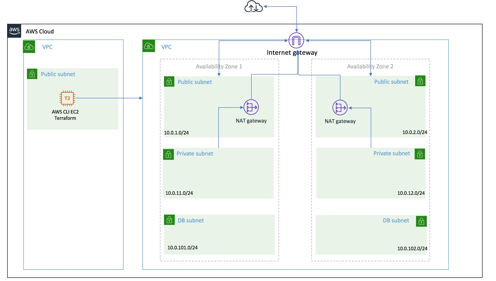
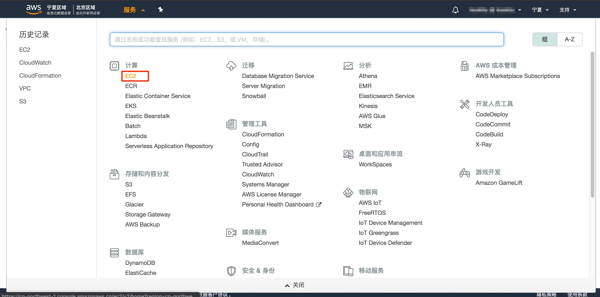
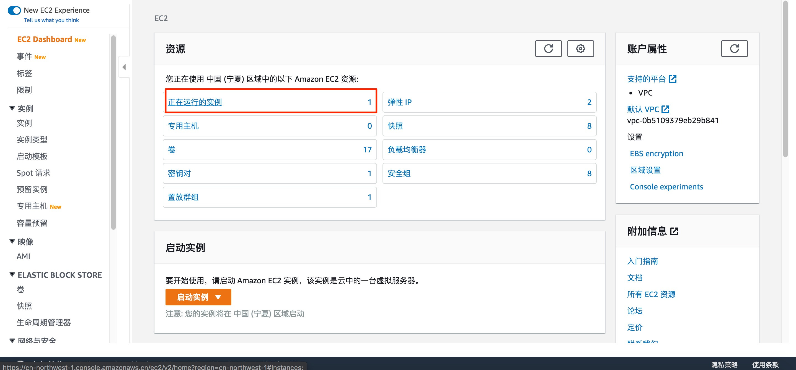
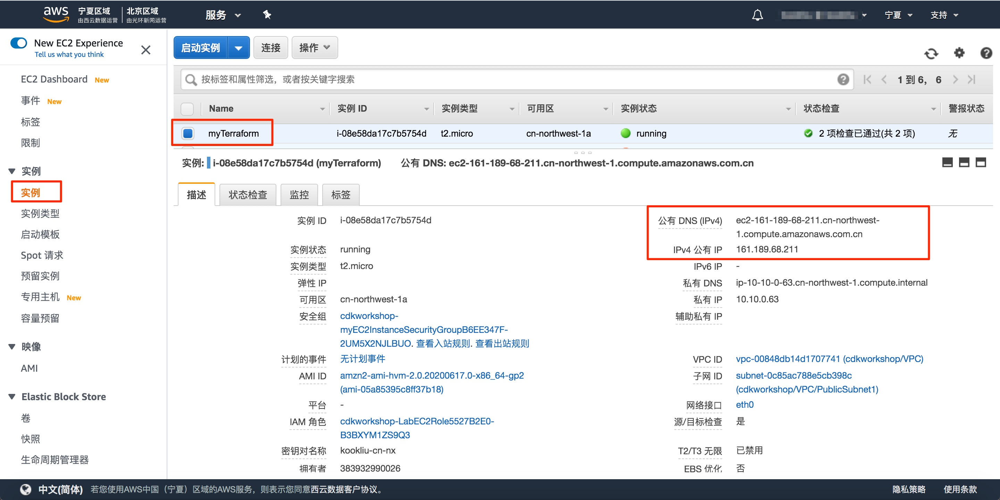
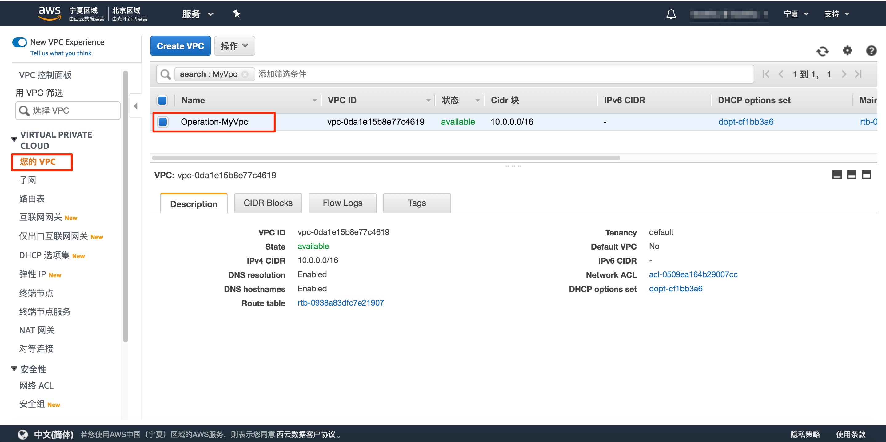
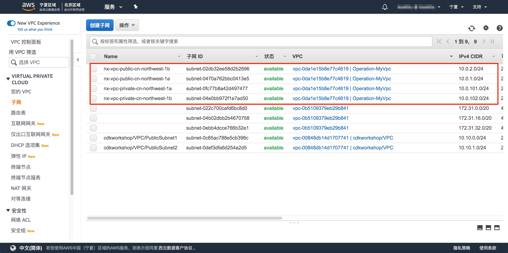

# 使用Terraform部署AWS VPC

#### 实验介绍：

本实验旨在通过AWS环境学习Terraform基础，通过本实验学习，掌握terrafom基本语法，对AWS作为Provider进行连接的方法。在之前的过程中，我们曾经学习过AWS   CLI进行创建VPC的过程，我们需要创建VPC、IGW 、Subnet、Nat GW等等，才能完成我们的VPC的基础网络环境创建。下面我们学习一下Terraform通常创建这些的语法和操作。


主要架构图如下，我们默认部署了一个EC2主机，作为我们的工作平台，后续的terraform就会安装在这台主机上。



#### 相关服务：

Terraform VPC等相关组件


#### 实验时间：

120分钟


#### 技术要求：

熟悉Terraform工具的基本概念。

掌握了AWS Console的基本控制方法

掌握如何登入到AWS上的实例


#### 目标一：登入我们的AWC CLI所在的Linux环境

##### 1.1 查看生成的AWS CLI主机。

在启动实验后，我登入到AWS Console的界面下，进入Ec2服务下。



点击正在运行的实例。



查看我们实验自动生成的实例”myTerraform“ 。



然后我们使用提供的key登入这台Linux系统。


#### 目标二：安装Terrafrom

terraform是go语言编写，安装文件就是二进制文件。我们去terraform的官网，去下载最新的Terraform的安装包。https://www.terraform.io/downloads.html

安装具体命令如下：

```shell
curl -o /tmp/terraform.zip https://releases.hashicorp.com/terraform/0.12.28/terraform_0.12.28_linux_amd64.zip
sudo unzip /tmp/terraform.zip -d /usr/local/bin
```

输出类似入下：

```
[ec2-user@ip-10-10-0-63 ~]$ curl -o /tmp/terraform.zip https://releases.hashicorp.com/terraform/0.12.28/terraform_0.12.28_linux_amd64.zip
  % Total    % Received % Xferd  Average Speed   Time    Time     Time  Current
                                 Dload  Upload   Total   Spent    Left  Speed
100 27.1M  100 27.1M    0     0  3289k      0  0:00:08  0:00:08 --:--:-- 4125k
[ec2-user@ip-10-10-0-63 ~]$ sudo unzip /tmp/terraform.zip -d /usr/local/bin
Archive:  /tmp/terraform.zip
  inflating: /usr/local/bin/terraform
```


如上，当前Terraform已经安装完毕。


#### 目标三：使用Terraform部署VPC


构建terraform的工作目录环境：

```
mkdir -p terraform-workspace/{terraform-modules,myFirstVPC}
```

添加terraform vpc模块

```
cd terraform-workspace/terraform-modules
git clone https://github.com/terraform-aws-modules/terraform-aws-vpc
```


创建连接文件，通常情况下，我们可以通过AK/SK连接访问到目标的account,进行管理。

```
cd terraform-workspace/myFirstVPC/
cat > provider.tf << EOF
provider "aws" {
  region = "cn-northwest-1"
}
EOF
```

在配置好provider之后，代表我们使用terraform可以管理AWS云上的相关资源，我们当前就可以进行初始化的动作，这个时候会下载aws provider plugin，会在当前目录下载。初始化命令：

```
terraform init
```

执行输出结果类似如下：

```
[ec2-user@ip-10-10-0-63 myFirstVPC]$ terraform  init

Initializing the backend...

Initializing provider plugins...
- Checking for available provider plugins...
- Downloading plugin for provider "aws" (hashicorp/aws) 2.70.0...

The following providers do not have any version constraints in configuration,
so the latest version was installed.

To prevent automatic upgrades to new major versions that may contain breaking
changes, it is recommended to add version = "..." constraints to the
corresponding provider blocks in configuration, with the constraint strings
suggested below.

* provider.aws: version = "~> 2.70"

Terraform has been successfully initialized!

You may now begin working with Terraform. Try running "terraform plan" to see
any changes that are required for your infrastructure. All Terraform commands
should now work.

If you ever set or change modules or backend configuration for Terraform,
rerun this command to reinitialize your working directory. If you forget, other
commands will detect it and remind you to do so if necessary.
```


编写VPC创建的调用文件

```shell
cat > main.tf << EOF
module "vpc" {
  source = "../terraform-modules/terraform-aws-vpc/"
  name = "nx-vpc"
  cidr = "10.0.0.0/16"

  azs             = ["cn-northwest-1a", "cn-northwest-1b"]
  public_subnets = ["10.0.1.0/24", "10.0.2.0/24"]
  private_subnets  = ["10.0.101.0/24", "10.0.102.0/24"]

  enable_dns_hostnames = true
  enable_dns_support   = true

  enable_nat_gateway = true
  single_nat_gateway = false

  tags = {
    Owner       = "opera"
    Environment = "dev"
  }

  vpc_tags = {
    Name = "Operation-MyVpc"
  }
}
```

再次执行初始化，每次我们使用新了模块。必须再次执行初始化。

```
terraform init
```

下面我们来进行资源创建之前的测试, 执行terraform plan后，会依据我们提供的参数来自动规划所需创建的资源关系。

```
terraform plan
```

输出结果类似如下，提示我们将要创建的资源列表和每个资源的属性信息：

```
[ec2-user@ip-10-10-0-63 myFirstVPC]$ terraform plan
Refreshing Terraform state in-memory prior to plan...
The refreshed state will be used to calculate this plan, but will not be
persisted to local or remote state storage.


------------------------------------------------------------------------

An execution plan has been generated and is shown below.
Resource actions are indicated with the following symbols:
  + create

Terraform will perform the following actions:

  # module.vpc.aws_eip.nat[0] will be created
  + resource "aws_eip" "nat" {
      + allocation_id     = (known after apply)
      + association_id    = (known after apply)
      + customer_owned_ip = (known after apply)
      + domain            = (known after apply)
      + id                = (known after apply)
      + instance          = (known after apply)
      + network_interface = (known after apply)
      + private_dns       = (known after apply)
      + private_ip        = (known after apply)
      + public_dns        = (known after apply)
      + public_ip         = (known after apply)
      + public_ipv4_pool  = (known after apply)
      + tags              = {
          + "Environment" = "dev"
          + "Name"        = "nx-vpc-cn-northwest-1a"
          + "Owner"       = "opera"
        }
      + vpc               = true
    }

  # module.vpc.aws_eip.nat[1] will be created
  + resource "aws_eip" "nat" {
      + allocation_id     = (known after apply)
      + association_id    = (known after apply)
      + customer_owned_ip = (known after apply)
      + domain            = (known after apply)
      + id                = (known after apply)
      + instance          = (known after apply)
      + network_interface = (known after apply)
      + private_dns       = (known after apply)
      + private_ip        = (known after apply)
      + public_dns        = (known after apply)
      + public_ip         = (known after apply)
      + public_ipv4_pool  = (known after apply)
      + tags              = {
          + "Environment" = "dev"
          + "Name"        = "nx-vpc-cn-northwest-1b"
          + "Owner"       = "opera"
        }
      + vpc               = true
    }

  # module.vpc.aws_internet_gateway.this[0] will be created
  + resource "aws_internet_gateway" "this" {
      + arn      = (known after apply)
      + id       = (known after apply)
      + owner_id = (known after apply)
      + tags     = {
          + "Environment" = "dev"
          + "Name"        = "nx-vpc"
          + "Owner"       = "opera"
        }
      + vpc_id   = (known after apply)
    }

  # module.vpc.aws_nat_gateway.this[0] will be created
  + resource "aws_nat_gateway" "this" {
      + allocation_id        = (known after apply)
      + id                   = (known after apply)
      + network_interface_id = (known after apply)
      + private_ip           = (known after apply)
      + public_ip            = (known after apply)
      + subnet_id            = (known after apply)
      + tags                 = {
          + "Environment" = "dev"
          + "Name"        = "nx-vpc-cn-northwest-1a"
          + "Owner"       = "opera"
        }
    }

  # module.vpc.aws_nat_gateway.this[1] will be created
  + resource "aws_nat_gateway" "this" {
      + allocation_id        = (known after apply)
      + id                   = (known after apply)
      + network_interface_id = (known after apply)
      + private_ip           = (known after apply)
      + public_ip            = (known after apply)
      + subnet_id            = (known after apply)
      + tags                 = {
          + "Environment" = "dev"
          + "Name"        = "nx-vpc-cn-northwest-1b"
          + "Owner"       = "opera"
        }
    }

  # module.vpc.aws_route.private_nat_gateway[0] will be created
  + resource "aws_route" "private_nat_gateway" {
      + destination_cidr_block     = "0.0.0.0/0"
      + destination_prefix_list_id = (known after apply)
      + egress_only_gateway_id     = (known after apply)
      + gateway_id                 = (known after apply)
      + id                         = (known after apply)
      + instance_id                = (known after apply)
      + instance_owner_id          = (known after apply)
      + nat_gateway_id             = (known after apply)
      + network_interface_id       = (known after apply)
      + origin                     = (known after apply)
      + route_table_id             = (known after apply)
      + state                      = (known after apply)

      + timeouts {
          + create = "5m"
        }
    }

  # module.vpc.aws_route.private_nat_gateway[1] will be created
  + resource "aws_route" "private_nat_gateway" {
      + destination_cidr_block     = "0.0.0.0/0"
      + destination_prefix_list_id = (known after apply)
      + egress_only_gateway_id     = (known after apply)
      + gateway_id                 = (known after apply)
      + id                         = (known after apply)
      + instance_id                = (known after apply)
      + instance_owner_id          = (known after apply)
      + nat_gateway_id             = (known after apply)
      + network_interface_id       = (known after apply)
      + origin                     = (known after apply)
      + route_table_id             = (known after apply)
      + state                      = (known after apply)

      + timeouts {
          + create = "5m"
        }
    }

  # module.vpc.aws_route.public_internet_gateway[0] will be created
  + resource "aws_route" "public_internet_gateway" {
      + destination_cidr_block     = "0.0.0.0/0"
      + destination_prefix_list_id = (known after apply)
      + egress_only_gateway_id     = (known after apply)
      + gateway_id                 = (known after apply)
      + id                         = (known after apply)
      + instance_id                = (known after apply)
      + instance_owner_id          = (known after apply)
      + nat_gateway_id             = (known after apply)
      + network_interface_id       = (known after apply)
      + origin                     = (known after apply)
      + route_table_id             = (known after apply)
      + state                      = (known after apply)

      + timeouts {
          + create = "5m"
        }
    }

  # module.vpc.aws_route_table.private[0] will be created
  + resource "aws_route_table" "private" {
      + id               = (known after apply)
      + owner_id         = (known after apply)
      + propagating_vgws = (known after apply)
      + route            = (known after apply)
      + tags             = {
          + "Environment" = "dev"
          + "Name"        = "nx-vpc-private-cn-northwest-1a"
          + "Owner"       = "opera"
        }
      + vpc_id           = (known after apply)
    }

  # module.vpc.aws_route_table.private[1] will be created
  + resource "aws_route_table" "private" {
      + id               = (known after apply)
      + owner_id         = (known after apply)
      + propagating_vgws = (known after apply)
      + route            = (known after apply)
      + tags             = {
          + "Environment" = "dev"
          + "Name"        = "nx-vpc-private-cn-northwest-1b"
          + "Owner"       = "opera"
        }
      + vpc_id           = (known after apply)
    }

  # module.vpc.aws_route_table.public[0] will be created
  + resource "aws_route_table" "public" {
      + id               = (known after apply)
      + owner_id         = (known after apply)
      + propagating_vgws = (known after apply)
      + route            = (known after apply)
      + tags             = {
          + "Environment" = "dev"
          + "Name"        = "nx-vpc-public"
          + "Owner"       = "opera"
        }
      + vpc_id           = (known after apply)
    }

  # module.vpc.aws_route_table_association.private[0] will be created
  + resource "aws_route_table_association" "private" {
      + id             = (known after apply)
      + route_table_id = (known after apply)
      + subnet_id      = (known after apply)
    }

  # module.vpc.aws_route_table_association.private[1] will be created
  + resource "aws_route_table_association" "private" {
      + id             = (known after apply)
      + route_table_id = (known after apply)
      + subnet_id      = (known after apply)
    }

  # module.vpc.aws_route_table_association.public[0] will be created
  + resource "aws_route_table_association" "public" {
      + id             = (known after apply)
      + route_table_id = (known after apply)
      + subnet_id      = (known after apply)
    }

  # module.vpc.aws_route_table_association.public[1] will be created
  + resource "aws_route_table_association" "public" {
      + id             = (known after apply)
      + route_table_id = (known after apply)
      + subnet_id      = (known after apply)
    }

  # module.vpc.aws_subnet.private[0] will be created
  + resource "aws_subnet" "private" {
      + arn                             = (known after apply)
      + assign_ipv6_address_on_creation = false
      + availability_zone               = "cn-northwest-1a"
      + availability_zone_id            = (known after apply)
      + cidr_block                      = "10.0.101.0/24"
      + id                              = (known after apply)
      + ipv6_cidr_block                 = (known after apply)
      + ipv6_cidr_block_association_id  = (known after apply)
      + map_public_ip_on_launch         = false
      + owner_id                        = (known after apply)
      + tags                            = {
          + "Environment" = "dev"
          + "Name"        = "nx-vpc-private-cn-northwest-1a"
          + "Owner"       = "opera"
        }
      + vpc_id                          = (known after apply)
    }

  # module.vpc.aws_subnet.private[1] will be created
  + resource "aws_subnet" "private" {
      + arn                             = (known after apply)
      + assign_ipv6_address_on_creation = false
      + availability_zone               = "cn-northwest-1b"
      + availability_zone_id            = (known after apply)
      + cidr_block                      = "10.0.102.0/24"
      + id                              = (known after apply)
      + ipv6_cidr_block                 = (known after apply)
      + ipv6_cidr_block_association_id  = (known after apply)
      + map_public_ip_on_launch         = false
      + owner_id                        = (known after apply)
      + tags                            = {
          + "Environment" = "dev"
          + "Name"        = "nx-vpc-private-cn-northwest-1b"
          + "Owner"       = "opera"
        }
      + vpc_id                          = (known after apply)
    }

  # module.vpc.aws_subnet.public[0] will be created
  + resource "aws_subnet" "public" {
      + arn                             = (known after apply)
      + assign_ipv6_address_on_creation = false
      + availability_zone               = "cn-northwest-1a"
      + availability_zone_id            = (known after apply)
      + cidr_block                      = "10.0.1.0/24"
      + id                              = (known after apply)
      + ipv6_cidr_block                 = (known after apply)
      + ipv6_cidr_block_association_id  = (known after apply)
      + map_public_ip_on_launch         = true
      + owner_id                        = (known after apply)
      + tags                            = {
          + "Environment" = "dev"
          + "Name"        = "nx-vpc-public-cn-northwest-1a"
          + "Owner"       = "opera"
        }
      + vpc_id                          = (known after apply)
    }

  # module.vpc.aws_subnet.public[1] will be created
  + resource "aws_subnet" "public" {
      + arn                             = (known after apply)
      + assign_ipv6_address_on_creation = false
      + availability_zone               = "cn-northwest-1b"
      + availability_zone_id            = (known after apply)
      + cidr_block                      = "10.0.2.0/24"
      + id                              = (known after apply)
      + ipv6_cidr_block                 = (known after apply)
      + ipv6_cidr_block_association_id  = (known after apply)
      + map_public_ip_on_launch         = true
      + owner_id                        = (known after apply)
      + tags                            = {
          + "Environment" = "dev"
          + "Name"        = "nx-vpc-public-cn-northwest-1b"
          + "Owner"       = "opera"
        }
      + vpc_id                          = (known after apply)
    }

  # module.vpc.aws_vpc.this[0] will be created
  + resource "aws_vpc" "this" {
      + arn                              = (known after apply)
      + assign_generated_ipv6_cidr_block = false
      + cidr_block                       = "10.0.0.0/16"
      + default_network_acl_id           = (known after apply)
      + default_route_table_id           = (known after apply)
      + default_security_group_id        = (known after apply)
      + dhcp_options_id                  = (known after apply)
      + enable_classiclink               = (known after apply)
      + enable_classiclink_dns_support   = (known after apply)
      + enable_dns_hostnames             = true
      + enable_dns_support               = true
      + id                               = (known after apply)
      + instance_tenancy                 = "default"
      + ipv6_association_id              = (known after apply)
      + ipv6_cidr_block                  = (known after apply)
      + main_route_table_id              = (known after apply)
      + owner_id                         = (known after apply)
      + tags                             = {
          + "Environment" = "dev"
          + "Name"        = "Operation-MyVpc"
          + "Owner"       = "opera"
        }
    }

Plan: 20 to add, 0 to change, 0 to destroy.

------------------------------------------------------------------------

Note: You didn't specify an "-out" parameter to save this plan, so Terraform
can't guarantee that exactly these actions will be performed if
"terraform apply" is subsequently run.
```

按照上面提示，我们就用terraform apply来实施当前vpc的部署, 执行后，提示输入yes确认。

```
terrafrom apply
```

接下来就会看到资源的创建，大概2-5分钟左右，就所有资源创建完毕了。

```
Do you want to perform these actions?
  Terraform will perform the actions described above.
  Only 'yes' will be accepted to approve.

  Enter a value: yes

module.vpc.aws_eip.nat[0]: Creating...
module.vpc.aws_eip.nat[1]: Creating...
module.vpc.aws_vpc.this[0]: Creating...
module.vpc.aws_eip.nat[1]: Creation complete after 0s [id=eipalloc-0923f32ceee10cfc3]
module.vpc.aws_eip.nat[0]: Creation complete after 0s [id=eipalloc-032e055d76b53eb9b]
module.vpc.aws_vpc.this[0]: Creation complete after 1s [id=vpc-0da1e15b8e77c4619]
module.vpc.aws_subnet.private[0]: Creating...
module.vpc.aws_route_table.public[0]: Creating...
module.vpc.aws_internet_gateway.this[0]: Creating...
module.vpc.aws_route_table.private[1]: Creating...
module.vpc.aws_subnet.public[1]: Creating...
module.vpc.aws_route_table.private[0]: Creating...
module.vpc.aws_subnet.public[0]: Creating...
module.vpc.aws_subnet.private[1]: Creating...
module.vpc.aws_route_table.public[0]: Creation complete after 0s [id=rtb-0aeedfd394ec92534]
module.vpc.aws_route_table.private[1]: Creation complete after 0s [id=rtb-0a46961b08788fcfc]
module.vpc.aws_route_table.private[0]: Creation complete after 1s [id=rtb-004b6070c0ed82c0a]
module.vpc.aws_internet_gateway.this[0]: Creation complete after 1s [id=igw-0319056fe6802a792]
module.vpc.aws_route.public_internet_gateway[0]: Creating...
module.vpc.aws_subnet.private[1]: Creation complete after 1s [id=subnet-04e0bb972f1e7ad50]
module.vpc.aws_subnet.private[0]: Creation complete after 1s [id=subnet-0fc77b8a42d497477]
module.vpc.aws_route.public_internet_gateway[0]: Creation complete after 0s [id=r-rtb-0aeedfd394ec925341080289494]
module.vpc.aws_route_table_association.private[0]: Creating...
module.vpc.aws_route_table_association.private[1]: Creating...
module.vpc.aws_subnet.public[0]: Creation complete after 1s [id=subnet-0470a762bbc0413e5]
module.vpc.aws_subnet.public[1]: Creation complete after 1s [id=subnet-02db32ee58d2b2696]
module.vpc.aws_route_table_association.public[1]: Creating...
module.vpc.aws_route_table_association.public[0]: Creating...
module.vpc.aws_nat_gateway.this[1]: Creating...
module.vpc.aws_nat_gateway.this[0]: Creating...
module.vpc.aws_route_table_association.private[0]: Creation complete after 0s [id=rtbassoc-08977867cfca1a25e]
module.vpc.aws_route_table_association.private[1]: Creation complete after 0s [id=rtbassoc-00d9a0fdd66dc69b8]
module.vpc.aws_route_table_association.public[0]: Creation complete after 0s [id=rtbassoc-0eea279f726988b16]
module.vpc.aws_route_table_association.public[1]: Creation complete after 0s [id=rtbassoc-04462b66a63340574]
module.vpc.aws_nat_gateway.this[1]: Still creating... [10s elapsed]
module.vpc.aws_nat_gateway.this[0]: Still creating... [10s elapsed]
module.vpc.aws_nat_gateway.this[1]: Still creating... [20s elapsed]
module.vpc.aws_nat_gateway.this[0]: Still creating... [20s elapsed]
module.vpc.aws_nat_gateway.this[1]: Still creating... [30s elapsed]
module.vpc.aws_nat_gateway.this[0]: Still creating... [30s elapsed]
module.vpc.aws_nat_gateway.this[1]: Still creating... [40s elapsed]
module.vpc.aws_nat_gateway.this[0]: Still creating... [40s elapsed]
module.vpc.aws_nat_gateway.this[1]: Still creating... [50s elapsed]
module.vpc.aws_nat_gateway.this[0]: Still creating... [50s elapsed]
module.vpc.aws_nat_gateway.this[1]: Still creating... [1m0s elapsed]
module.vpc.aws_nat_gateway.this[0]: Still creating... [1m0s elapsed]
module.vpc.aws_nat_gateway.this[1]: Still creating... [1m10s elapsed]
module.vpc.aws_nat_gateway.this[0]: Still creating... [1m10s elapsed]
module.vpc.aws_nat_gateway.this[1]: Still creating... [1m20s elapsed]
module.vpc.aws_nat_gateway.this[0]: Still creating... [1m20s elapsed]
module.vpc.aws_nat_gateway.this[1]: Still creating... [1m30s elapsed]
module.vpc.aws_nat_gateway.this[0]: Still creating... [1m30s elapsed]
module.vpc.aws_nat_gateway.this[1]: Creation complete after 1m34s [id=nat-08379fc087f92e007]
module.vpc.aws_nat_gateway.this[0]: Still creating... [1m40s elapsed]
module.vpc.aws_nat_gateway.this[0]: Creation complete after 1m44s [id=nat-003a3bbaf3b3c33f5]
module.vpc.aws_route.private_nat_gateway[0]: Creating...
module.vpc.aws_route.private_nat_gateway[1]: Creating...
module.vpc.aws_route.private_nat_gateway[1]: Creation complete after 0s [id=r-rtb-0a46961b08788fcfc1080289494]
module.vpc.aws_route.private_nat_gateway[0]: Creation complete after 0s [id=r-rtb-004b6070c0ed82c0a1080289494]

Apply complete! Resources: 20 added, 0 changed, 0 destroyed.
```

相信大家在和AWS CLI对比后，会有非常直观的感受。


我们现在就可以登录到AWS 的图形Console上来看一下我们执行后的结果：



我们再查看一下subnet, 这里我们创建了4个subnet，分别对应2个AZ的Public和Private




##### 请大家自行在AWS图形Console 仔细检查点击互联网网关、NAT网关，路由表信息来查看配置情况。


另外大家注意到了一个问题，我们目前没有数据库的subnet，那我们如何添加呢？


下面我们做一个变更，直接在原来的main.tf上新增加一行：

  database_subnets    = ["10.0.11.0/24", "10.0.12.0/24"]    

```
module "vpc" {
  source = "../terraform-modules/terraform-aws-vpc/"
  name = "nx-vpc"
  cidr = "10.0.0.0/16"

  azs             = ["cn-northwest-1a", "cn-northwest-1b"]
  public_subnets = ["10.0.1.0/24", "10.0.2.0/24"]
  private_subnets  = ["10.0.101.0/24", "10.0.102.0/24"]
  database_subnets    = ["10.0.11.0/24", "10.0.12.0/24"]           

  enable_dns_hostnames = true
  enable_dns_support   = true

  enable_nat_gateway = true
  single_nat_gateway = false

  tags = {
    Owner       = "opera"
    Environment = "dev"
  }

  vpc_tags = {
    Name = "Operation-MyVpc"
  }
}
```

我们再次执行terraform plan查看一下，在当前情况下，提示新增资源的状态。

```
terrafrom plan
```

结果类似如下，我们观察提示，会看到刷新的存在的资源，然后告诉您新建的资源有哪些。

```
[ec2-user@ip-10-10-0-63 myFirstVPC]$ terraform plan
Refreshing Terraform state in-memory prior to plan...
The refreshed state will be used to calculate this plan, but will not be
persisted to local or remote state storage.

module.vpc.aws_eip.nat[0]: Refreshing state... [id=eipalloc-032e055d76b53eb9b]
module.vpc.aws_vpc.this[0]: Refreshing state... [id=vpc-0da1e15b8e77c4619]
module.vpc.aws_eip.nat[1]: Refreshing state... [id=eipalloc-0923f32ceee10cfc3]
module.vpc.aws_subnet.public[1]: Refreshing state... [id=subnet-02db32ee58d2b2696]
module.vpc.aws_subnet.private[1]: Refreshing state... [id=subnet-04e0bb972f1e7ad50]
module.vpc.aws_subnet.private[0]: Refreshing state... [id=subnet-0fc77b8a42d497477]
module.vpc.aws_internet_gateway.this[0]: Refreshing state... [id=igw-0319056fe6802a792]
module.vpc.aws_route_table.public[0]: Refreshing state... [id=rtb-0aeedfd394ec92534]
module.vpc.aws_route_table.private[0]: Refreshing state... [id=rtb-004b6070c0ed82c0a]
module.vpc.aws_route_table.private[1]: Refreshing state... [id=rtb-0a46961b08788fcfc]
module.vpc.aws_subnet.public[0]: Refreshing state... [id=subnet-0470a762bbc0413e5]
module.vpc.aws_route_table_association.private[0]: Refreshing state... [id=rtbassoc-08977867cfca1a25e]
module.vpc.aws_route_table_association.private[1]: Refreshing state... [id=rtbassoc-00d9a0fdd66dc69b8]
module.vpc.aws_route.public_internet_gateway[0]: Refreshing state... [id=r-rtb-0aeedfd394ec925341080289494]
module.vpc.aws_nat_gateway.this[0]: Refreshing state... [id=nat-003a3bbaf3b3c33f5]
module.vpc.aws_route_table_association.public[0]: Refreshing state... [id=rtbassoc-0eea279f726988b16]
module.vpc.aws_nat_gateway.this[1]: Refreshing state... [id=nat-08379fc087f92e007]
module.vpc.aws_route_table_association.public[1]: Refreshing state... [id=rtbassoc-04462b66a63340574]
module.vpc.aws_route.private_nat_gateway[0]: Refreshing state... [id=r-rtb-004b6070c0ed82c0a1080289494]
module.vpc.aws_route.private_nat_gateway[1]: Refreshing state... [id=r-rtb-0a46961b08788fcfc1080289494]

------------------------------------------------------------------------

An execution plan has been generated and is shown below.
Resource actions are indicated with the following symbols:
  + create

Terraform will perform the following actions:

  # module.vpc.aws_db_subnet_group.database[0] will be created
  + resource "aws_db_subnet_group" "database" {
      + arn         = (known after apply)
      + description = "Database subnet group for nx-vpc"
      + id          = (known after apply)
      + name        = "nx-vpc"
      + name_prefix = (known after apply)
      + subnet_ids  = (known after apply)
      + tags        = {
          + "Environment" = "dev"
          + "Name"        = "nx-vpc"
          + "Owner"       = "opera"
        }
    }

  # module.vpc.aws_route_table_association.database[0] will be created
  + resource "aws_route_table_association" "database" {
      + id             = (known after apply)
      + route_table_id = "rtb-004b6070c0ed82c0a"
      + subnet_id      = (known after apply)
    }

  # module.vpc.aws_route_table_association.database[1] will be created
  + resource "aws_route_table_association" "database" {
      + id             = (known after apply)
      + route_table_id = "rtb-0a46961b08788fcfc"
      + subnet_id      = (known after apply)
    }

  # module.vpc.aws_subnet.database[0] will be created
  + resource "aws_subnet" "database" {
      + arn                             = (known after apply)
      + assign_ipv6_address_on_creation = false
      + availability_zone               = "cn-northwest-1a"
      + availability_zone_id            = (known after apply)
      + cidr_block                      = "10.0.11.0/24"
      + id                              = (known after apply)
      + ipv6_cidr_block                 = (known after apply)
      + ipv6_cidr_block_association_id  = (known after apply)
      + map_public_ip_on_launch         = false
      + owner_id                        = (known after apply)
      + tags                            = {
          + "Environment" = "dev"
          + "Name"        = "nx-vpc-db-cn-northwest-1a"
          + "Owner"       = "opera"
        }
      + vpc_id                          = "vpc-0da1e15b8e77c4619"
    }

  # module.vpc.aws_subnet.database[1] will be created
  + resource "aws_subnet" "database" {
      + arn                             = (known after apply)
      + assign_ipv6_address_on_creation = false
      + availability_zone               = "cn-northwest-1b"
      + availability_zone_id            = (known after apply)
      + cidr_block                      = "10.0.12.0/24"
      + id                              = (known after apply)
      + ipv6_cidr_block                 = (known after apply)
      + ipv6_cidr_block_association_id  = (known after apply)
      + map_public_ip_on_launch         = false
      + owner_id                        = (known after apply)
      + tags                            = {
          + "Environment" = "dev"
          + "Name"        = "nx-vpc-db-cn-northwest-1b"
          + "Owner"       = "opera"
        }
      + vpc_id                          = "vpc-0da1e15b8e77c4619"
    }

Plan: 5 to add, 0 to change, 0 to destroy.

------------------------------------------------------------------------

Note: You didn't specify an "-out" parameter to save this plan, so Terraform
can't guarantee that exactly these actions will be performed if
"terraform apply" is subsequently run.
```

我们再次执行terraform apply, 按照提示输入yes

```
terraform apply
```

我们观察执行的结果类似如下：

```
[ec2-user@ip-10-10-0-63 myFirstVPC]$ terraform apply
......
Plan: 5 to add, 0 to change, 0 to destroy.

Do you want to perform these actions?
  Terraform will perform the actions described above.
  Only 'yes' will be accepted to approve.

  Enter a value: yes

module.vpc.aws_subnet.database[1]: Creating...
module.vpc.aws_subnet.database[0]: Creating...
module.vpc.aws_subnet.database[0]: Creation complete after 0s [id=subnet-0daa7d65199aeb644]
module.vpc.aws_subnet.database[1]: Creation complete after 0s [id=subnet-018f628fc73f15d4b]
module.vpc.aws_route_table_association.database[0]: Creating...
module.vpc.aws_db_subnet_group.database[0]: Creating...
module.vpc.aws_route_table_association.database[1]: Creating...
module.vpc.aws_route_table_association.database[1]: Creation complete after 0s [id=rtbassoc-0511e316db5f99599]
module.vpc.aws_route_table_association.database[0]: Creation complete after 0s [id=rtbassoc-00c03ab9f4f06b122]
module.vpc.aws_db_subnet_group.database[0]: Creation complete after 1s [id=nx-vpc]

Apply complete! Resources: 5 added, 0 changed, 0 destroyed.
```

所以在Terraform的使用上，变更也非常简单。

我们再次登入图形界面，查看当前的subnet情况。


#### 目标四：尝试实现一下任务

任务1： 当前只有2个AZ，如何实现3个AZ，满足Public/Private/Database9个Subnet的情况。

任务2： 如何添加output.tf文件，来输出更多的内容。

请参考：https://github.com/terraform-aws-modules/terraform-aws-vpc/tree/master/examples


#### 目标五：删除我们所有创建的资源。

我们执行terraform destory，按照提示输入yes, 就删除了所有我们创建的资源。

```
terraform destory
```

具体执行命令输出类似如下：

```
[ec2-user@ip-10-10-0-63 myFirstVPC]$  terraform destroy
module.vpc.aws_vpc.this[0]: Refreshing state... [id=vpc-0da1e15b8e77c4619]
module.vpc.aws_eip.nat[1]: Refreshing state... [id=eipalloc-0923f32ceee10cfc3]
module.vpc.aws_eip.nat[0]: Refreshing state... [id=eipalloc-032e055d76b53eb9b]
module.vpc.aws_subnet.database[1]: Refreshing state... [id=subnet-018f628fc73f15d4b]
module.vpc.aws_subnet.public[1]: Refreshing state... [id=subnet-02db32ee58d2b2696]
module.vpc.aws_route_table.private[1]: Refreshing state... [id=rtb-0a46961b08788fcfc]
module.vpc.aws_subnet.database[0]: Refreshing state... [id=subnet-0daa7d65199aeb644]
module.vpc.aws_route_table.public[0]: Refreshing state... [id=rtb-0aeedfd394ec92534]
module.vpc.aws_subnet.public[0]: Refreshing state... [id=subnet-0470a762bbc0413e5]
module.vpc.aws_internet_gateway.this[0]: Refreshing state... [id=igw-0319056fe6802a792]
module.vpc.aws_route_table.private[0]: Refreshing state... [id=rtb-004b6070c0ed82c0a]
module.vpc.aws_subnet.private[0]: Refreshing state... [id=subnet-0fc77b8a42d497477]
module.vpc.aws_subnet.private[1]: Refreshing state... [id=subnet-04e0bb972f1e7ad50]
module.vpc.aws_route.public_internet_gateway[0]: Refreshing state... [id=r-rtb-0aeedfd394ec925341080289494]
module.vpc.aws_nat_gateway.this[0]: Refreshing state... [id=nat-003a3bbaf3b3c33f5]
module.vpc.aws_nat_gateway.this[1]: Refreshing state... [id=nat-08379fc087f92e007]
module.vpc.aws_route_table_association.public[0]: Refreshing state... [id=rtbassoc-0eea279f726988b16]
module.vpc.aws_route_table_association.public[1]: Refreshing state... [id=rtbassoc-04462b66a63340574]
module.vpc.aws_db_subnet_group.database[0]: Refreshing state... [id=nx-vpc]
module.vpc.aws_route_table_association.private[1]: Refreshing state... [id=rtbassoc-00d9a0fdd66dc69b8]
module.vpc.aws_route_table_association.private[0]: Refreshing state... [id=rtbassoc-08977867cfca1a25e]
module.vpc.aws_route_table_association.database[0]: Refreshing state... [id=rtbassoc-00c03ab9f4f06b122]
module.vpc.aws_route_table_association.database[1]: Refreshing state... [id=rtbassoc-0511e316db5f99599]
module.vpc.aws_route.private_nat_gateway[0]: Refreshing state... [id=r-rtb-004b6070c0ed82c0a1080289494]
module.vpc.aws_route.private_nat_gateway[1]: Refreshing state... [id=r-rtb-0a46961b08788fcfc1080289494]

An execution plan has been generated and is shown below.
Resource actions are indicated with the following symbols:
  - destroy

Terraform will perform the following actions:

  # module.vpc.aws_db_subnet_group.database[0] will be destroyed
  - resource "aws_db_subnet_group" "database" {
      - arn         = "arn:aws-cn:rds:cn-northwest-1:383932990026:subgrp:nx-vpc" -> null
      - description = "Database subnet group for nx-vpc" -> null
      - id          = "nx-vpc" -> null
      - name        = "nx-vpc" -> null
      - subnet_ids  = [
          - "subnet-018f628fc73f15d4b",
          - "subnet-0daa7d65199aeb644",
        ] -> null
      - tags        = {
          - "Environment" = "dev"
          - "Name"        = "nx-vpc"
          - "Owner"       = "opera"
        } -> null
    }

  # module.vpc.aws_eip.nat[0] will be destroyed
  - resource "aws_eip" "nat" {
      - association_id    = "eipassoc-022a18e7fe27ae9e0" -> null
      - domain            = "vpc" -> null
      - id                = "eipalloc-032e055d76b53eb9b" -> null
      - network_interface = "eni-0f647dab837c4f1f5" -> null
      - private_dns       = "ip-10-0-1-97.cn-northwest-1.compute.internal" -> null
      - private_ip        = "10.0.1.97" -> null
      - public_dns        = "ec2-52-83-167-116.cn-northwest-1.compute.amazonaws.com.cn" -> null
      - public_ip         = "52.83.167.116" -> null
      - public_ipv4_pool  = "amazon" -> null
      - tags              = {
          - "Environment" = "dev"
          - "Name"        = "nx-vpc-cn-northwest-1a"
          - "Owner"       = "opera"
        } -> null
      - vpc               = true -> null
    }

  # module.vpc.aws_eip.nat[1] will be destroyed
  - resource "aws_eip" "nat" {
      - association_id    = "eipassoc-092b9ee468149112e" -> null
      - domain            = "vpc" -> null
      - id                = "eipalloc-0923f32ceee10cfc3" -> null
      - network_interface = "eni-0b627d96b519408bf" -> null
      - private_dns       = "ip-10-0-2-76.cn-northwest-1.compute.internal" -> null
      - private_ip        = "10.0.2.76" -> null
      - public_dns        = "ec2-52-83-195-52.cn-northwest-1.compute.amazonaws.com.cn" -> null
      - public_ip         = "52.83.195.52" -> null
      - public_ipv4_pool  = "amazon" -> null
      - tags              = {
          - "Environment" = "dev"
          - "Name"        = "nx-vpc-cn-northwest-1b"
          - "Owner"       = "opera"
        } -> null
      - vpc               = true -> null
    }

  # module.vpc.aws_internet_gateway.this[0] will be destroyed
  - resource "aws_internet_gateway" "this" {
      - arn      = "arn:aws-cn:ec2:cn-northwest-1:383932990026:internet-gateway/igw-0319056fe6802a792" -> null
      - id       = "igw-0319056fe6802a792" -> null
      - owner_id = "383932990026" -> null
      - tags     = {
          - "Environment" = "dev"
          - "Name"        = "nx-vpc"
          - "Owner"       = "opera"
        } -> null
      - vpc_id   = "vpc-0da1e15b8e77c4619" -> null
    }

  # module.vpc.aws_nat_gateway.this[0] will be destroyed
  - resource "aws_nat_gateway" "this" {
      - allocation_id        = "eipalloc-032e055d76b53eb9b" -> null
      - id                   = "nat-003a3bbaf3b3c33f5" -> null
      - network_interface_id = "eni-0f647dab837c4f1f5" -> null
      - private_ip           = "10.0.1.97" -> null
      - public_ip            = "52.83.167.116" -> null
      - subnet_id            = "subnet-0470a762bbc0413e5" -> null
      - tags                 = {
          - "Environment" = "dev"
          - "Name"        = "nx-vpc-cn-northwest-1a"
          - "Owner"       = "opera"
        } -> null
    }

  # module.vpc.aws_nat_gateway.this[1] will be destroyed
  - resource "aws_nat_gateway" "this" {
      - allocation_id        = "eipalloc-0923f32ceee10cfc3" -> null
      - id                   = "nat-08379fc087f92e007" -> null
      - network_interface_id = "eni-0b627d96b519408bf" -> null
      - private_ip           = "10.0.2.76" -> null
      - public_ip            = "52.83.195.52" -> null
      - subnet_id            = "subnet-02db32ee58d2b2696" -> null
      - tags                 = {
          - "Environment" = "dev"
          - "Name"        = "nx-vpc-cn-northwest-1b"
          - "Owner"       = "opera"
        } -> null
    }

  # module.vpc.aws_route.private_nat_gateway[0] will be destroyed
  - resource "aws_route" "private_nat_gateway" {
      - destination_cidr_block = "0.0.0.0/0" -> null
      - id                     = "r-rtb-004b6070c0ed82c0a1080289494" -> null
      - nat_gateway_id         = "nat-003a3bbaf3b3c33f5" -> null
      - origin                 = "CreateRoute" -> null
      - route_table_id         = "rtb-004b6070c0ed82c0a" -> null
      - state                  = "active" -> null

      - timeouts {
          - create = "5m" -> null
        }
    }

  # module.vpc.aws_route.private_nat_gateway[1] will be destroyed
  - resource "aws_route" "private_nat_gateway" {
      - destination_cidr_block = "0.0.0.0/0" -> null
      - id                     = "r-rtb-0a46961b08788fcfc1080289494" -> null
      - nat_gateway_id         = "nat-08379fc087f92e007" -> null
      - origin                 = "CreateRoute" -> null
      - route_table_id         = "rtb-0a46961b08788fcfc" -> null
      - state                  = "active" -> null

      - timeouts {
          - create = "5m" -> null
        }
    }

  # module.vpc.aws_route.public_internet_gateway[0] will be destroyed
  - resource "aws_route" "public_internet_gateway" {
      - destination_cidr_block = "0.0.0.0/0" -> null
      - gateway_id             = "igw-0319056fe6802a792" -> null
      - id                     = "r-rtb-0aeedfd394ec925341080289494" -> null
      - origin                 = "CreateRoute" -> null
      - route_table_id         = "rtb-0aeedfd394ec92534" -> null
      - state                  = "active" -> null

      - timeouts {
          - create = "5m" -> null
        }
    }

  # module.vpc.aws_route_table.private[0] will be destroyed
  - resource "aws_route_table" "private" {
      - id               = "rtb-004b6070c0ed82c0a" -> null
      - owner_id         = "383932990026" -> null
      - propagating_vgws = [] -> null
      - route            = [
          - {
              - cidr_block                = "0.0.0.0/0"
              - egress_only_gateway_id    = ""
              - gateway_id                = ""
              - instance_id               = ""
              - ipv6_cidr_block           = ""
              - nat_gateway_id            = "nat-003a3bbaf3b3c33f5"
              - network_interface_id      = ""
              - transit_gateway_id        = ""
              - vpc_peering_connection_id = ""
            },
        ] -> null
      - tags             = {
          - "Environment" = "dev"
          - "Name"        = "nx-vpc-private-cn-northwest-1a"
          - "Owner"       = "opera"
        } -> null
      - vpc_id           = "vpc-0da1e15b8e77c4619" -> null
    }

  # module.vpc.aws_route_table.private[1] will be destroyed
  - resource "aws_route_table" "private" {
      - id               = "rtb-0a46961b08788fcfc" -> null
      - owner_id         = "383932990026" -> null
      - propagating_vgws = [] -> null
      - route            = [
          - {
              - cidr_block                = "0.0.0.0/0"
              - egress_only_gateway_id    = ""
              - gateway_id                = ""
              - instance_id               = ""
              - ipv6_cidr_block           = ""
              - nat_gateway_id            = "nat-08379fc087f92e007"
              - network_interface_id      = ""
              - transit_gateway_id        = ""
              - vpc_peering_connection_id = ""
            },
        ] -> null
      - tags             = {
          - "Environment" = "dev"
          - "Name"        = "nx-vpc-private-cn-northwest-1b"
          - "Owner"       = "opera"
        } -> null
      - vpc_id           = "vpc-0da1e15b8e77c4619" -> null
    }

  # module.vpc.aws_route_table.public[0] will be destroyed
  - resource "aws_route_table" "public" {
      - id               = "rtb-0aeedfd394ec92534" -> null
      - owner_id         = "383932990026" -> null
      - propagating_vgws = [] -> null
      - route            = [
          - {
              - cidr_block                = "0.0.0.0/0"
              - egress_only_gateway_id    = ""
              - gateway_id                = "igw-0319056fe6802a792"
              - instance_id               = ""
              - ipv6_cidr_block           = ""
              - nat_gateway_id            = ""
              - network_interface_id      = ""
              - transit_gateway_id        = ""
              - vpc_peering_connection_id = ""
            },
        ] -> null
      - tags             = {
          - "Environment" = "dev"
          - "Name"        = "nx-vpc-public"
          - "Owner"       = "opera"
        } -> null
      - vpc_id           = "vpc-0da1e15b8e77c4619" -> null
    }

  # module.vpc.aws_route_table_association.database[0] will be destroyed
  - resource "aws_route_table_association" "database" {
      - id             = "rtbassoc-00c03ab9f4f06b122" -> null
      - route_table_id = "rtb-004b6070c0ed82c0a" -> null
      - subnet_id      = "subnet-0daa7d65199aeb644" -> null
    }

  # module.vpc.aws_route_table_association.database[1] will be destroyed
  - resource "aws_route_table_association" "database" {
      - id             = "rtbassoc-0511e316db5f99599" -> null
      - route_table_id = "rtb-0a46961b08788fcfc" -> null
      - subnet_id      = "subnet-018f628fc73f15d4b" -> null
    }

  # module.vpc.aws_route_table_association.private[0] will be destroyed
  - resource "aws_route_table_association" "private" {
      - id             = "rtbassoc-08977867cfca1a25e" -> null
      - route_table_id = "rtb-004b6070c0ed82c0a" -> null
      - subnet_id      = "subnet-0fc77b8a42d497477" -> null
    }

  # module.vpc.aws_route_table_association.private[1] will be destroyed
  - resource "aws_route_table_association" "private" {
      - id             = "rtbassoc-00d9a0fdd66dc69b8" -> null
      - route_table_id = "rtb-0a46961b08788fcfc" -> null
      - subnet_id      = "subnet-04e0bb972f1e7ad50" -> null
    }

  # module.vpc.aws_route_table_association.public[0] will be destroyed
  - resource "aws_route_table_association" "public" {
      - id             = "rtbassoc-0eea279f726988b16" -> null
      - route_table_id = "rtb-0aeedfd394ec92534" -> null
      - subnet_id      = "subnet-0470a762bbc0413e5" -> null
    }

  # module.vpc.aws_route_table_association.public[1] will be destroyed
  - resource "aws_route_table_association" "public" {
      - id             = "rtbassoc-04462b66a63340574" -> null
      - route_table_id = "rtb-0aeedfd394ec92534" -> null
      - subnet_id      = "subnet-02db32ee58d2b2696" -> null
    }

  # module.vpc.aws_subnet.database[0] will be destroyed
  - resource "aws_subnet" "database" {
      - arn                             = "arn:aws-cn:ec2:cn-northwest-1:383932990026:subnet/subnet-0daa7d65199aeb644" -> null
      - assign_ipv6_address_on_creation = false -> null
      - availability_zone               = "cn-northwest-1a" -> null
      - availability_zone_id            = "cnnw1-az1" -> null
      - cidr_block                      = "10.0.11.0/24" -> null
      - id                              = "subnet-0daa7d65199aeb644" -> null
      - map_public_ip_on_launch         = false -> null
      - owner_id                        = "383932990026" -> null
      - tags                            = {
          - "Environment" = "dev"
          - "Name"        = "nx-vpc-db-cn-northwest-1a"
          - "Owner"       = "opera"
        } -> null
      - vpc_id                          = "vpc-0da1e15b8e77c4619" -> null
    }

  # module.vpc.aws_subnet.database[1] will be destroyed
  - resource "aws_subnet" "database" {
      - arn                             = "arn:aws-cn:ec2:cn-northwest-1:383932990026:subnet/subnet-018f628fc73f15d4b" -> null
      - assign_ipv6_address_on_creation = false -> null
      - availability_zone               = "cn-northwest-1b" -> null
      - availability_zone_id            = "cnnw1-az2" -> null
      - cidr_block                      = "10.0.12.0/24" -> null
      - id                              = "subnet-018f628fc73f15d4b" -> null
      - map_public_ip_on_launch         = false -> null
      - owner_id                        = "383932990026" -> null
      - tags                            = {
          - "Environment" = "dev"
          - "Name"        = "nx-vpc-db-cn-northwest-1b"
          - "Owner"       = "opera"
        } -> null
      - vpc_id                          = "vpc-0da1e15b8e77c4619" -> null
    }

  # module.vpc.aws_subnet.private[0] will be destroyed
  - resource "aws_subnet" "private" {
      - arn                             = "arn:aws-cn:ec2:cn-northwest-1:383932990026:subnet/subnet-0fc77b8a42d497477" -> null
      - assign_ipv6_address_on_creation = false -> null
      - availability_zone               = "cn-northwest-1a" -> null
      - availability_zone_id            = "cnnw1-az1" -> null
      - cidr_block                      = "10.0.101.0/24" -> null
      - id                              = "subnet-0fc77b8a42d497477" -> null
      - map_public_ip_on_launch         = false -> null
      - owner_id                        = "383932990026" -> null
      - tags                            = {
          - "Environment" = "dev"
          - "Name"        = "nx-vpc-private-cn-northwest-1a"
          - "Owner"       = "opera"
        } -> null
      - vpc_id                          = "vpc-0da1e15b8e77c4619" -> null
    }

  # module.vpc.aws_subnet.private[1] will be destroyed
  - resource "aws_subnet" "private" {
      - arn                             = "arn:aws-cn:ec2:cn-northwest-1:383932990026:subnet/subnet-04e0bb972f1e7ad50" -> null
      - assign_ipv6_address_on_creation = false -> null
      - availability_zone               = "cn-northwest-1b" -> null
      - availability_zone_id            = "cnnw1-az2" -> null
      - cidr_block                      = "10.0.102.0/24" -> null
      - id                              = "subnet-04e0bb972f1e7ad50" -> null
      - map_public_ip_on_launch         = false -> null
      - owner_id                        = "383932990026" -> null
      - tags                            = {
          - "Environment" = "dev"
          - "Name"        = "nx-vpc-private-cn-northwest-1b"
          - "Owner"       = "opera"
        } -> null
      - vpc_id                          = "vpc-0da1e15b8e77c4619" -> null
    }

  # module.vpc.aws_subnet.public[0] will be destroyed
  - resource "aws_subnet" "public" {
      - arn                             = "arn:aws-cn:ec2:cn-northwest-1:383932990026:subnet/subnet-0470a762bbc0413e5" -> null
      - assign_ipv6_address_on_creation = false -> null
      - availability_zone               = "cn-northwest-1a" -> null
      - availability_zone_id            = "cnnw1-az1" -> null
      - cidr_block                      = "10.0.1.0/24" -> null
      - id                              = "subnet-0470a762bbc0413e5" -> null
      - map_public_ip_on_launch         = true -> null
      - owner_id                        = "383932990026" -> null
      - tags                            = {
          - "Environment" = "dev"
          - "Name"        = "nx-vpc-public-cn-northwest-1a"
          - "Owner"       = "opera"
        } -> null
      - vpc_id                          = "vpc-0da1e15b8e77c4619" -> null
    }

  # module.vpc.aws_subnet.public[1] will be destroyed
  - resource "aws_subnet" "public" {
      - arn                             = "arn:aws-cn:ec2:cn-northwest-1:383932990026:subnet/subnet-02db32ee58d2b2696" -> null
      - assign_ipv6_address_on_creation = false -> null
      - availability_zone               = "cn-northwest-1b" -> null
      - availability_zone_id            = "cnnw1-az2" -> null
      - cidr_block                      = "10.0.2.0/24" -> null
      - id                              = "subnet-02db32ee58d2b2696" -> null
      - map_public_ip_on_launch         = true -> null
      - owner_id                        = "383932990026" -> null
      - tags                            = {
          - "Environment" = "dev"
          - "Name"        = "nx-vpc-public-cn-northwest-1b"
          - "Owner"       = "opera"
        } -> null
      - vpc_id                          = "vpc-0da1e15b8e77c4619" -> null
    }

  # module.vpc.aws_vpc.this[0] will be destroyed
  - resource "aws_vpc" "this" {
      - arn                              = "arn:aws-cn:ec2:cn-northwest-1:383932990026:vpc/vpc-0da1e15b8e77c4619" -> null
      - assign_generated_ipv6_cidr_block = false -> null
      - cidr_block                       = "10.0.0.0/16" -> null
      - default_network_acl_id           = "acl-0509ea164b29007cc" -> null
      - default_route_table_id           = "rtb-0938a83dfc7e21907" -> null
      - default_security_group_id        = "sg-0a9fcd86d89edee0d" -> null
      - dhcp_options_id                  = "dopt-cf1bb3a6" -> null
      - enable_dns_hostnames             = true -> null
      - enable_dns_support               = true -> null
      - id                               = "vpc-0da1e15b8e77c4619" -> null
      - instance_tenancy                 = "default" -> null
      - main_route_table_id              = "rtb-0938a83dfc7e21907" -> null
      - owner_id                         = "383932990026" -> null
      - tags                             = {
          - "Environment" = "dev"
          - "Name"        = "Operation-MyVpc"
          - "Owner"       = "opera"
        } -> null
    }

Plan: 0 to add, 0 to change, 25 to destroy.

Do you really want to destroy all resources?
  Terraform will destroy all your managed infrastructure, as shown above.
  There is no undo. Only 'yes' will be accepted to confirm.

  Enter a value: yes

module.vpc.aws_route_table_association.private[1]: Destroying... [id=rtbassoc-00d9a0fdd66dc69b8]
module.vpc.aws_route_table_association.public[0]: Destroying... [id=rtbassoc-0eea279f726988b16]
module.vpc.aws_route_table_association.database[0]: Destroying... [id=rtbassoc-00c03ab9f4f06b122]
module.vpc.aws_db_subnet_group.database[0]: Destroying... [id=nx-vpc]
module.vpc.aws_route.private_nat_gateway[0]: Destroying... [id=r-rtb-004b6070c0ed82c0a1080289494]
module.vpc.aws_route.public_internet_gateway[0]: Destroying... [id=r-rtb-0aeedfd394ec925341080289494]
module.vpc.aws_route_table_association.private[0]: Destroying... [id=rtbassoc-08977867cfca1a25e]
module.vpc.aws_route_table_association.public[1]: Destroying... [id=rtbassoc-04462b66a63340574]
module.vpc.aws_route_table_association.database[1]: Destroying... [id=rtbassoc-0511e316db5f99599]
module.vpc.aws_route.private_nat_gateway[1]: Destroying... [id=r-rtb-0a46961b08788fcfc1080289494]
module.vpc.aws_db_subnet_group.database[0]: Destruction complete after 0s
module.vpc.aws_route.private_nat_gateway[0]: Destruction complete after 0s
module.vpc.aws_route.public_internet_gateway[0]: Destruction complete after 0s
module.vpc.aws_route.private_nat_gateway[1]: Destruction complete after 0s
module.vpc.aws_nat_gateway.this[1]: Destroying... [id=nat-08379fc087f92e007]
module.vpc.aws_nat_gateway.this[0]: Destroying... [id=nat-003a3bbaf3b3c33f5]
module.vpc.aws_route_table_association.database[0]: Destruction complete after 0s
module.vpc.aws_route_table_association.database[1]: Destruction complete after 0s
module.vpc.aws_subnet.database[0]: Destroying... [id=subnet-0daa7d65199aeb644]
module.vpc.aws_subnet.database[1]: Destroying... [id=subnet-018f628fc73f15d4b]
module.vpc.aws_route_table_association.public[0]: Destruction complete after 0s
module.vpc.aws_route_table_association.private[1]: Destruction complete after 0s
module.vpc.aws_route_table_association.public[1]: Destruction complete after 0s
module.vpc.aws_route_table.public[0]: Destroying... [id=rtb-0aeedfd394ec92534]
module.vpc.aws_route_table_association.private[0]: Destruction complete after 0s
module.vpc.aws_route_table.private[0]: Destroying... [id=rtb-004b6070c0ed82c0a]
module.vpc.aws_subnet.private[1]: Destroying... [id=subnet-04e0bb972f1e7ad50]
module.vpc.aws_route_table.private[1]: Destroying... [id=rtb-0a46961b08788fcfc]
module.vpc.aws_subnet.private[0]: Destroying... [id=subnet-0fc77b8a42d497477]
module.vpc.aws_route_table.public[0]: Destruction complete after 0s
module.vpc.aws_route_table.private[1]: Destruction complete after 0s
module.vpc.aws_route_table.private[0]: Destruction complete after 0s
module.vpc.aws_subnet.database[0]: Destruction complete after 0s
module.vpc.aws_subnet.database[1]: Destruction complete after 0s
module.vpc.aws_subnet.private[0]: Destruction complete after 0s
module.vpc.aws_subnet.private[1]: Destruction complete after 0s
module.vpc.aws_nat_gateway.this[1]: Still destroying... [id=nat-08379fc087f92e007, 10s elapsed]
module.vpc.aws_nat_gateway.this[0]: Still destroying... [id=nat-003a3bbaf3b3c33f5, 10s elapsed]
module.vpc.aws_nat_gateway.this[0]: Still destroying... [id=nat-003a3bbaf3b3c33f5, 20s elapsed]
module.vpc.aws_nat_gateway.this[1]: Still destroying... [id=nat-08379fc087f92e007, 20s elapsed]
module.vpc.aws_nat_gateway.this[1]: Still destroying... [id=nat-08379fc087f92e007, 30s elapsed]
module.vpc.aws_nat_gateway.this[0]: Still destroying... [id=nat-003a3bbaf3b3c33f5, 30s elapsed]
module.vpc.aws_nat_gateway.this[0]: Still destroying... [id=nat-003a3bbaf3b3c33f5, 40s elapsed]
module.vpc.aws_nat_gateway.this[1]: Still destroying... [id=nat-08379fc087f92e007, 40s elapsed]
module.vpc.aws_nat_gateway.this[0]: Destruction complete after 40s
module.vpc.aws_nat_gateway.this[1]: Still destroying... [id=nat-08379fc087f92e007, 50s elapsed]
module.vpc.aws_nat_gateway.this[1]: Still destroying... [id=nat-08379fc087f92e007, 1m0s elapsed]
module.vpc.aws_nat_gateway.this[1]: Destruction complete after 1m1s
module.vpc.aws_internet_gateway.this[0]: Destroying... [id=igw-0319056fe6802a792]
module.vpc.aws_eip.nat[1]: Destroying... [id=eipalloc-0923f32ceee10cfc3]
module.vpc.aws_subnet.public[1]: Destroying... [id=subnet-02db32ee58d2b2696]
module.vpc.aws_subnet.public[0]: Destroying... [id=subnet-0470a762bbc0413e5]
module.vpc.aws_eip.nat[0]: Destroying... [id=eipalloc-032e055d76b53eb9b]
module.vpc.aws_eip.nat[1]: Destruction complete after 0s
module.vpc.aws_subnet.public[1]: Destruction complete after 0s
module.vpc.aws_subnet.public[0]: Destruction complete after 0s
module.vpc.aws_eip.nat[0]: Destruction complete after 0s
module.vpc.aws_internet_gateway.this[0]: Still destroying... [id=igw-0319056fe6802a792, 10s elapsed]
module.vpc.aws_internet_gateway.this[0]: Destruction complete after 10s
module.vpc.aws_vpc.this[0]: Destroying... [id=vpc-0da1e15b8e77c4619]
module.vpc.aws_vpc.this[0]: Destruction complete after 0s

Destroy complete! Resources: 25 destroyed.
```

